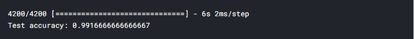
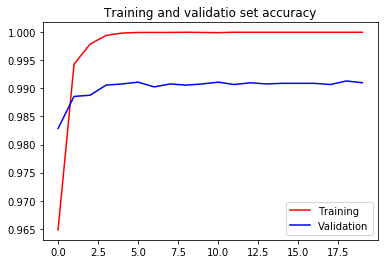

The Digit Recognizer is a multi-class classification problem. The data files train.csv and test.csv contain 28*28 pixels gray scale images. We will approach the problem in six major steps:

1. Dataset import and pre-processing
2. Designing CNN architecture
3. Training the networks
4. Predict on test dataset
5. Plotting necessary diagrams
6. Saving output

## PIP Install

Use the package manager [pip](https://pip.pypa.io/en/stable/) to install all necessary libraries.

```bash
pip install foobar
```

## DATASET IMPORT AND PRE-PROCESSING

```python
# Libraries
import pandas as pd
import numpy as np

import tensorflow as tf
import keras
from keras.models import Sequential
from keras.layers import Dense, Activation, Dropout, Flatten, Conv2D, MaxPooling2D, AveragePooling2D
from keras.layers.normalization import BatchNormalization
from keras.callbacks import ReduceLROnPlateau

from sklearn.model_selection import train_test_split

import matplotlib.pyplot as plt

import itertools

import seaborn as sns

# Reading dataset
X =  pd.read_csv("../input/train.csv")
X_test_main =  pd.read_csv("../input/test.csv")

# Extract label info
y = X["label"]

X = X.drop(['label'],axis = 1)

# Reshape image matrix
X = X.values.reshape(-1, 28, 28, 1).astype('float32')
X_test_main = X_test_main.values.reshape(-1, 28, 28, 1).astype('float32')

y = y.values
```

```python
# Sample train image plotting:
plt.figure()
plt.imshow( X[1][:,:,0])
plt.colorbar()
plt.grid(False)
plt.show()
```


## Data Normalization:
The type of pixel value is integer and the range is in between 0 to 255. In order to convert the value 0 to 1 range, we will divide it by 255.

```python
X = X / 255.0
X_test_main = X_test_main / 255.0
```
```python
# Train and test dataset split
X_train, X_test, y_train, y_test = train_test_split(X, y, test_size=0.1, random_state=42,stratify=y)
```

## DESIGNING CNN ARCHITECTURE
The CNN architecture is designed using 3 convolution layers and 3 fully connected (FC) layers. The summary of the architecture is given bellow:

CONV 1 --
MAX POOLING 1 --
NORMALIZATION 1

CONV 2 --
MAX POOLING 2 --
NORMALIZATION 2

CONV 3 --
MAX POOLING 3 --
NORMALIZATION 3

FC 1 --
FC 2 --
FC 3 (Softmax)

```python
model = Sequential()
    
# CONV 1
model.add(Conv2D(filters=32, kernel_size=(3,3), activation="relu", strides=(1,1), padding="valid"))
#model.add(Activation="relu")
# MAX POOL 1
model.add(MaxPooling2D(pool_size=(3,3), strides=(1,1), padding="valid"))
# NORM 1
model.add(BatchNormalization())


# CONV 2
model.add(Conv2D(filters=64, kernel_size=(3,3), activation="relu", strides=(1,1), padding="valid"))
#model.add(Activation="relu")
# MAX POOL 2
model.add(MaxPooling2D(pool_size=(3,3), strides=(1,1), padding="valid"))
# NORM 2
model.add(BatchNormalization())


# CONV 3
model.add(Conv2D(filters=128, kernel_size=(3,3), activation="relu", strides=(1,1), padding="valid"))
#model.add(Activation="relu")
# MAX POOL 3
model.add(MaxPooling2D(pool_size=(3,3), strides=(1,1), padding="valid"))
# NORM 3
model.add(BatchNormalization())


# Flatten
model.add(Flatten())

# FC 1
model.add(Dense(units=512, activation="relu"))
#model.add(Dropout=0.2)

# FC 2
model.add(Dense(units=120, activation="relu"))
#model.add(Dropout=0.2)

# FC 3
model.add(Dense(units=10, activation = "softmax"))
```

## Compile the sequential model:
The following hyper parameter values are used to compile the generated model.

learning rate=0.001

weight decay=1e-6

momentum=0.9

```python
sgd = keras.optimizers.SGD(lr=0.001, decay=1e-6, momentum=0.9, nesterov=True)
model.compile(loss="sparse_categorical_crossentropy", optimizer=sgd, metrics=["sparse_categorical_accuracy"])

# ReduceLROnPlateau is a function from keras.callbacks.
# The following line of code reduces the learning rate by 0.5 if accuracy does not improve after 3 epochs.
lrr = ReduceLROnPlateau(monitor='val_acc', patience=3, verbose=1, factor=0.5, min_lr=0.00001)
```

## TRAINING THE NETWORKS: 

The following hyper parameter values are used to train the neural networks:

batch_size=40

epochs=20

verbose = 2

validation_split=0.25

```python
# The following traing is based on splitted test and train dataset

result = model.fit(X_train, 
                   y_train, 
                   batch_size=70, 
                   epochs=20, 
                   verbose=2, 
                   validation_split=0.25, 
                   callbacks=[lrr],
                   shuffle=True)

'''
result = model.fit(X, 
                   y, 
                   batch_size=70, 
                   epochs=3, 
                   verbose=2, 
                   validation_split=0.25, 
                   callbacks=[lrr],
                   shuffle=True)
'''
```

## PREDICT ON TEST DATA: 

```python
y_pred = model.predict(X_test, verbose = 2)
#y_pred = model.predict(X_test_main, verbose = 2)

y_pred[:,0]
```

```python
# Loss and accuracy
test_loss, test_acc = model.evaluate(X_test, y_test)
print('Test accuracy:', test_acc)
```



## PLOTTING:

```python
# Plot training and validation accuracy
acc = result.history['sparse_categorical_accuracy']
val_acc = result.history['val_sparse_categorical_accuracy']
epochs = range(len(acc))
plt.plot(epochs, acc, 'r', label='Training')
plt.plot(epochs, val_acc, 'b', label='Validation')
plt.title('Training and validatio set accuracy')
plt.legend(loc=0)
plt.figure()
plt.show()
```


## References:

http://neuralnetworksanddeeplearning.com
